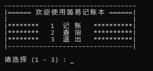
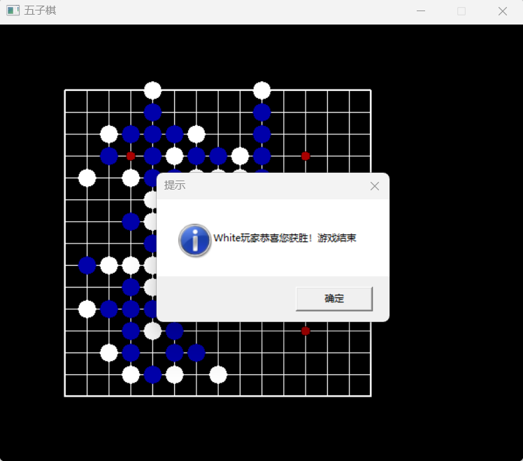

# CPP-Final-Assignment
C++面向对象程序设计期末作业（记账本和五子棋）

两个程序都已编译为exe可执行文件，存放在相应源码文件夹下。

### 简易记账本
终端程序，主要有记账（收入、支出）和查账功能，初次执行时会在程序当前文件下生成一个名为AccountBook.txt的文件，用来存放账目信息，因此多次执行程序后账目信息不会丢失。

### 五子棋
基于easyx图像库开发的小程序，目前只能一个人操作鼠标完成落子，当有五个棋子连成一条线时某玩家获胜，并弹出提示框。

 
